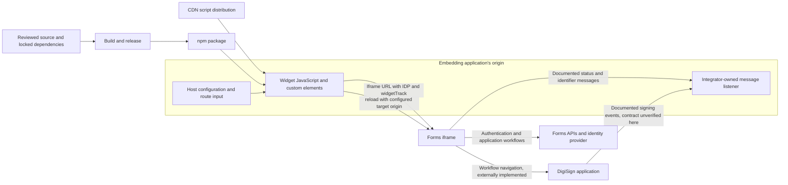

# Threat model: SkySlope Forms Widget

## Scope and assessment basis

`@skyslope/forms-widget` is a Stencil web-component library that runs in an embedding application's page and creates an iframe for SkySlope Forms. Its buttons navigate to listing, transaction, library, buyer-agreement, and envelope routes; containers present the frame inline or in a modal. The parent-side library does not implement Forms authentication, tenant authorization, document storage, or signing. Those controls belong to the framed applications and their APIs.

This assessment uses local source, configuration, documentation, tests, package manifests/lockfile, and release workflows inspected on 2026-09-11. It covers the shipped component/control surface and documented integration contract. It excludes remote Forms/DigiSign implementation, identity-provider configuration, actual framing/CSP/cookie headers, host applications, CDN/Argo configuration, npm account controls, and live deployments. No network requests, browser navigation, authentication, installations, publishing, or application mutations were performed. No credentials were found necessary for this review or reproduced here.

P1 means prioritize because compromise could affect embedding hosts or sensitive workflows. P2 means a bounded integration weakness or conditional risk needing deployment verification. A documented prerequisite or intended control is not treated as proof that deployed enforcement exists.

## Components, assets, and actors

| Component | Security-relevant behavior and evidence |
| --- | --- |
| Global controller | `src/globalScript.ts:SkySlopeWidget` places a mutable singleton on `window.skyslope.widget`; holds path, IDP, inline mode, header variant, and navigation/reload callbacks. |
| Inline iframe | `src/components/ss-container-inline/ss-container-inline.tsx` constructs URLs, adds tracking/configuration query parameters, assigns `iframe.src`, and sends a fixed reload message. |
| Modal and buttons | `ss-container-modal.tsx` wraps the inline frame with customizable styles, overlay, and header controls. Button components call controller helpers and optionally open a modal. |
| Environment binding | `environment.ts` defines development, integration, staging, and production Forms URLs. `stencil.config.ts` chooses one at build time; development is the default. |
| Event integration | `readme.md:Listening for Events` documents a host-owned `message` listener and file/document/envelope metadata. The runtime library contains no inbound `window.message` validation/dispatch implementation. |
| Distribution | `package.json`, `release.config.js`, and `.github/workflows/release.yml` build/publish the package. README examples also load CDN scripts through a mutable `latest` path. CDN publication details are not implemented in the inspected workflow. |

Assets include the embedding application's DOM/session/storage, user trust in the displayed Forms/signing UI, correct environment and SSO selection, continuity of unsaved work, file/document/envelope identifiers emitted to the host, route/tracking metadata, and the integrity of npm/CDN artifacts and release authority. Forms credentials and document bytes may exist inside the remote frame but are not explicitly read, stored, or posted by this parent-side code.

Actors include host integrators, end users, Forms/DigiSign and identity-provider owners, package/CDN maintainers, and CI administrators. Relevant attackers could compromise a host or one of its same-origin scripts, alter a distributed widget build, control less-trusted values passed by an integrator, or send unrelated `postMessage` traffic from another window. Merely controlling an unrelated origin does not grant parent DOM access or permission to read the Forms iframe.

## Data flows and trust boundaries

The principal boundaries are executable distribution into the host origin; host-controlled navigation/configuration into a remote authenticated application; browser same-origin isolation between host and iframe; remote-window messages into host business logic; and development versus production build endpoints. The README's CDN/Argo description is an external distribution claim, not a verified deployment flow.

1. `initialize` stores host-supplied `idp`, `openInline`, and `headerVariant`. These are configuration hints, not authentication assertions.
2. Navigation helpers set a path. `getUrl` concatenates the build-time Forms base and path, then uses `URL`/`URLSearchParams` to set query parameters.
3. `widgetTrack` includes the host's origin, the literal event label `click`, and the complete configured widget path. It does not collect the host page's full URL, but the supplied path can itself contain sensitive query/fragment data.
4. The iframe handles user authentication and Forms workflows externally. The parent sends only the string `reload`, with the configured Forms URL as `targetOrigin`, in the reviewed messaging code.
5. Integrators are expected to receive remote status/identifier messages themselves. Their validation, follow-up API authorization, and handling of signing-origin transitions are outside this implementation.
6. Removing an inline container reinitializes the global controller. Multiple containers compete for a single callback registration and global configuration.

## Existing controls and limitations

- Production, staging, and integration URLs are fixed HTTPS values in `environment.ts`; ordinary runtime initialization cannot select an arbitrary iframe base. The development URL is HTTP localhost.
- `URLSearchParams` encodes added query values. With the checked-in trailing-slash base, an absolute-looking supplied path remains a path under that base; a local check confirmed this behavior. No direct arbitrary-origin navigation or script-URL execution is established by simple `navigateTo` input.
- `reloadIframe` uses a specific target URL rather than wildcard `*`, and sends no document data or token. This protects outbound delivery but does not verify messages received by an integrator. If the frame has navigated to a different origin, reload delivery requires a separately verified protocol decision.
- A cross-origin iframe preserves browser same-origin isolation. Shadow DOM provides component/style encapsulation, not a security boundary against the parent page's scripts. The iframe has no sandbox or explicit referrer policy and allows fullscreen.
- The README explicitly requires integrators to obtain framing approval and configure company SSO. The actual server-side frame allowlist, authentication policy, and object authorization are not in this repository.
- Duplicate navigation/reload callback registration throws rather than silently replacing an existing callback. This detects unsupported multiple-container use but does not provide robust instance ownership or lifecycle recovery.
- Release uses `npm ci`, an existing lockfile, an explicit production build, output-directory checks, and `npm pack --dry-run`; npm packaging is limited to `dist/` and `loader/`. The checks do not exercise security or message/lifecycle behavior.

## Prioritized threats

### FW-01 — Distributed widget code executes with the embedding host's authority

**Priority/category:** P1; supply-chain tampering, information disclosure, elevation of privilege. **Likelihood:** Conditional on compromise of package/release/CDN authority or a consumed dependency; mutable updates increase change exposure.

**Path and impact:** A malicious widget artifact runs as JavaScript in every integrating host page, before any iframe isolation helps. It can read host-origin data accessible to page scripts, alter login/signing presentation, replace the iframe, or exfiltrate host information. The README's default `latest` CDN integration can introduce new executable code without a host version change. This does not mean the legitimate widget currently reads host credentials or that it can directly read a cross-origin Forms document.

**Controls/evidence:** npm consumers can pin a package/lockfile; CDN documentation offers versioned examples; release uses `npm ci` and a production build. See `readme.md:Installation with CDN`, `package.json`, `package-lock.json`, `release.config.js`, and `.github/workflows/release.yml`. Script examples have no integrity attribute; the release job has access to publishing authority and uses tag-referenced actions. Actual CDN publishing, permissions, and provenance are unknown.

**Mitigation:** Prefer immutable vetted versions and verify the complete lazy-loaded artifact set, not only the initial loader. Apply appropriate integrity/provenance controls, restrictive host CSP, protected publishing/release approvals, and narrowly scoped short-lived publishing credentials where supported. Document update/rollback responsibilities and verify CDN version paths against real artifacts through an authorized release review.

**Residual risk:** An approved release can still contain application defects. Host integration should minimize unrelated sensitive functionality and third-party scripts on the embedding page.

### FW-02 — The documented inbound message contract is incomplete and currently rejects valid origins

**Priority/category:** P2; message integrity and availability, potentially P1 if consumers turn events into privileged actions. **Likelihood:** High for integrators copying the example exactly; injection impact depends on how an integration changes or supplements it.

**Path and impact:** The example compares `event.origin` with a hostname without its scheme. A browser reports an origin including scheme, so legitimate HTTPS Forms messages do not satisfy that condition. Even after correcting that mismatch, the example lacks `event.source` binding to the intended iframe, payload-size/schema checks, status-specific identifier validation, and guarded JSON parsing. Other trusted-origin windows or malformed payloads can cause cross-workflow confusion or exceptions if accepted by the host. An unrelated hostile origin is not accepted by the exact broken comparison; this is not a proven arbitrary-origin bypass in shipped runtime code.

**Controls/evidence:** The README attempts an origin check, and outgoing reload uses a fixed target origin. See `readme.md:Listening for Events` and `ss-container-inline.tsx:reloadIframe`. There is no central receive-side listener in the library. Signing events may originate elsewhere, but their emitter/origin behavior is not available here.

**Mitigation:** Publish or implement a validated receiver that checks exact environment-specific origins and the expected frame window, validates versioned discriminated payloads, catches parse errors, and correlates messages to a specific workflow. Treat returned IDs as references requiring server-side access checks, not proof of authorization or completion. Add tests for unexpected origins/sources, malformed data, and signing transitions.

**Residual risk:** A compromised genuinely trusted remote application can emit valid-looking messages. Sensitive follow-up actions need independent server authorization and business-state verification.

### FW-03 — Embedded presentation depends on the trustworthiness of approved hosts

**Priority/category:** P2; UI redressing, phishing, and user-intent integrity. **Likelihood:** Conditional on a malicious/compromised approved embedder, excessive framing permissions, or compromised framed application.

**Path and impact:** A host controls the surrounding page, modal positioning, overlay, header buttons, and other visual cues. It can misrepresent the context of a real Forms workflow or obscure important application chrome. The unsandboxed iframe and fullscreen capability also leave more browser behavior available to the remote application than a deliberately minimized embedding policy would. Browser restrictions still apply; no unconditional top-navigation or parent-DOM escape is asserted.

**Controls/evidence:** Cross-origin isolation prevents ordinary direct DOM reads. Framing approval is required by `readme.md`, while `ss-container-modal.tsx` intentionally exposes styling/chrome options and `ss-container-inline.tsx:render` sets no sandbox and enables fullscreen. `headerVariant=focused` is documented as hiding navigation/settings, not as an authorization mode.

**Mitigation:** Enforce precise server-side `frame-ancestors` policies on every relevant Forms/DigiSign/login surface, review host onboarding, and retain clear identity/transaction/confirmation cues for consequential steps. Evaluate a minimal compatible sandbox and permissions policy through realistic authentication/download/signing tests; do not add permissions blindly or assume every workflow supports full sandboxing.

**Residual risk:** An approved host can always mislead users with its own page. Server-side confirmation, identity checks, and trusted high-impact workflow presentation remain necessary.

### FW-04 — Navigation and SSO hints may be mistaken for access control

**Priority/category:** P2; confused identity/context and unauthorized object access if downstream enforcement is missing. **Likelihood:** Conditional on integrators feeding less-trusted route values or remote authorization weaknesses.

**Path and impact:** The API accepts arbitrary paths and interpolates envelope IDs without runtime type/format validation. A caller can choose another route, identifier, query, or fragment inside the configured application. IDP and focused-header values are likewise caller-controlled presentation/login hints. An integrator or backend that treats those choices, or an event's returned file ID, as authorization can show the wrong workflow or fetch an object outside intended scope. This repository alone does not establish a Forms/DigiSign IDOR, authentication bypass, or cross-origin open redirect.

**Controls/evidence:** Convenience buttons use fixed `SkyslopePaths` values, the base origin is build-controlled, and URL query values are encoded. See `src/globalScript.ts:navigateTo/navigateToEnvelope/initialize`, `src/components/ss-container-inline/types.ts`, and `ss-container-inline.tsx:getUrl`. Any downstream redirects/auth behavior is external.

**Mitigation:** Validate and encode identifiers; constrain public integration inputs to supported routes and parameters; distinguish trusted host configuration from user-supplied URLs. Require remote APIs to enforce user/tenant/object authorization independently of iframe hints and require SSO configuration to bind approved identities/companies. Test wrong IDs and invalid hints against isolated mock contracts before authorized integration tests.

**Residual risk:** Even valid navigation can reference an inaccessible or stale object. The application must display clear authorization/context errors rather than implying the host selected an authorized target.

### FW-05 — Tracking query parameters disclose and misattribute navigation context

**Priority/category:** P2; information disclosure and telemetry integrity. **Likelihood:** Medium when integrations put sensitive data in custom paths or downstream URL logs/analytics have broad access.

**Path and impact:** Every iframe URL includes JSON tracking with the embedding origin and full `widget.path`. Queries or fragments supplied within that path are copied into an actual query parameter, so data that would otherwise remain in a fragment can become visible to the destination and its URL-processing infrastructure. IDP/header hints also travel in the URL. `widgetSourceEvent` is always `click`, including programmatic navigation, and the supplied route is not trustworthy audit evidence.

**Controls/evidence:** The code collects the host origin, not the full host page URL, and uses proper query encoding. Encoding is not redaction. Evidence: `ss-container-inline.tsx:getUrl/addUrlParams` and the public `navigateTo` API. The iframe specifies no explicit `referrerPolicy`; browser defaults and remote response policies were not tested. No current credential-bearing path or deployed log exposure is established.

**Mitigation:** Prohibit secrets and unnecessary personal data in route/configuration inputs; track a bounded route label or sanitized path without queries/fragments. Document collection purpose, recipients, and retention; set an appropriate explicit referrer policy. Treat all client-supplied tracking as untrusted and distinguish actual user gestures from programmatic calls.

**Residual risk:** Required file/envelope identifiers and host origins may still be sensitive metadata. Remote logging and analytics need access and retention controls.

### FW-06 — Global lifecycle resets can lose SSO configuration and interrupt active work

**Priority/category:** P2; workflow integrity and availability. **Likelihood:** Medium to high in single-page applications with repeated mounting, multiple modal triggers, or direct initialization without a restoring `onLoad` hook.

**Path and impact:** `openModal` appends a new modal without checking whether one already exists, but only one navigation/reload callback may register. Removing an inline container reconstructs the global widget, clearing its path, IDP, inline mode, and header variant unless the host's `onLoad` restores them. Closing one instance can therefore change behavior for another, and subsequent navigation may use a different login presentation or interrupt unsaved work. It does not clear or switch the remote authentication session by itself, so cross-tenant access is not demonstrated.

**Controls/evidence:** Duplicate registration fails explicitly and `closeModal` removes the first matching modal. `src/globalScript.ts:openModal/registerReload/registerNavigateTo` and `ss-container-inline.tsx:disconnectedCallback` establish the singleton coupling. Local source-derived checks confirmed duplicate registration rejection and configuration loss on reset with no restoring callback.

**Mitigation:** Define an instance lifecycle: enforce one live container or give each independent controller state. Unregister only the disconnecting instance's callbacks, preserve immutable initialization settings, prevent duplicate open operations, and expose predictable teardown/ready behavior. Test mount/unmount, repeated opens, route changes, and pending-edit flows with mocked frames.

**Residual risk:** Host applications can still destroy an iframe or navigate away. Remote drafts/recovery and clear user warnings are needed for unsaved transactions.

### FW-07 — Build/environment drift and shallow release checks can ship the wrong integration

**Priority/category:** P2; environment integrity, availability, and assurance. **Likelihood:** Medium for manual/custom builds; lower for the checked-in release command, which explicitly selects production.

**Path and impact:** The Stencil configuration defaults to development and processes environment flags in order. A build with missing or conflicting flags can embed the localhost or wrong-environment endpoint, yielding failed loads or unexpected login/data context when distributed to a production host. The release workflow verifies directories and package contents, but runs neither component tests nor source lint. Current inline/modal spec expectations are slot-only scaffold markup rather than the iframe/modal structures in source, leaving security-relevant URL, message, and lifecycle behavior without demonstrated release coverage.

**Controls/evidence:** `package.json` provides explicit environment-specific scripts; `.github/workflows/release.yml` calls `build:prod`; lockfile installation and package allowlisting help reproducibility. See `stencil.config.ts`, `environment.ts`, `src/components/ss-container-inline/test/`, `ss-container-modal/test/`, and `.github/workflows/commitlint.yml`. Tests were inspected, not run; no claim is made about their observed pass/fail status. CDN instructions contain differing example paths, while actual CDN automation is not present here.

**Mitigation:** Fail release builds on ambiguous/missing environment selection, inspect the built endpoint/artifact manifest, require unit/contract/browser tests with network interception, and verify published version paths. Keep production and test artifacts clearly separated and immutable. Add explicit checks for iframe origin, receiver validation, SSO hints, and lifecycle restoration to the real release gate.

**Residual risk:** Correctly built code still depends on remote APIs, cookies, framing policies, and browser behavior. Maintain an authorized cross-origin integration test matrix and rollback process.

## Open questions and recommended validation

1. **Forms/DigiSign owners:** Which exact origins emit each event, what serializes the payload, and which parent origins may receive it? Are sender-side `targetOrigin`, `frame-ancestors`, object authorization, and sensitive-action confirmation enforced on every transition?
2. **Host integrators:** Can untrusted input reach route/IDP/style settings? Where are returned identifiers used? Does every receiver verify both origin and frame source, validate payloads, and distinguish status notifications from authoritative backend state?
3. **Identity owners:** What binds IDP hints to a company, and how do framed SSO, existing sessions, third-party cookie restrictions, logout, and focused-header navigation behave? The widget contains no independent identity proof.
4. **Release/CDN owners:** Which workflow publishes CDN artifacts, are version URLs immutable, how is `latest` promoted, and what account/branch/provenance controls govern publishing? Do the documented module/nomodule paths resolve to the intended version?
5. **Privacy owners:** Can custom paths contain personal data or tokens, and who can read destination/CDN/proxy analytics? Is fragment duplication into `widgetTrack` intentional? What retention and referrer policies apply?
6. **Component owners:** Is exactly one container supported, and does the host restore initialization on every teardown? Are refresh semantics defined after DigiSign or SSO navigation changes the frame origin?

Start with isolated tests using synthetic origins and mock frames: URL construction/parameter encoding, tracking redaction, unknown route/ID rejection, exact source/origin checks, malformed or repeated messages, configuration preservation, and multiple-instance handling. Then perform an explicitly authorized browser matrix for SSO, framing policies, signing transitions, downloads/fullscreen, cookies, and teardown recovery. Do not use the demo site or production Forms as incidental unit-test dependencies.

## Validation performed and limitations

- Initial worktree status was clean. No repository-specific `AGENTS.md` was found. Only this document was added; no source, release configuration, credentials, or Git history was changed.
- Source-derived in-memory checks used the real controller and extracted URL-construction methods with mocked globals and synthetic `.invalid` origins. They confirmed parameter encoding/tracking, configured-origin preservation for an absolute-looking path, duplicate callback rejection, configuration loss on reset, and browser-origin scheme semantics. An initial harness-only syntax mistake was corrected before the successful run; no repository source was edited for testing.
- `node --check` passed for `release.config.js` and `deployment/getPackageVersion.js`. Package, lockfile, TypeScript configuration, and ESLint JSON parsed successfully.
- These are narrow source/contract checks, not a Stencil component build or real cross-origin browser test. Full spec/E2E tests, dependency installation, remote header checks, package publishing, and live integrations were not run.
