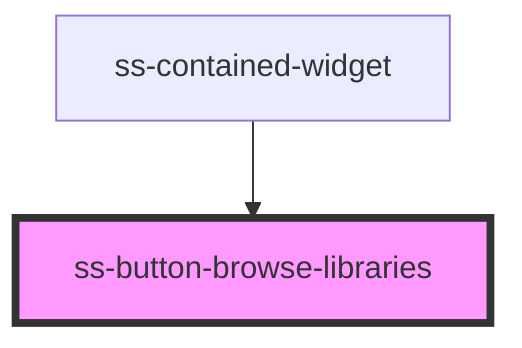

# ss-button-browse-libraries

<!-- Auto Generated Below -->

## Properties

| Property   | Attribute  | Description | Type      | Default |
| ---------- | ---------- | ----------- | --------- | ------- |
| `unstyled` | `unstyled` |             | `boolean` | `false` |

## Dependencies

### Used by

 - [ss-contained-widget](../ss-contained-widget)

### Graph

----------------------------------------------

