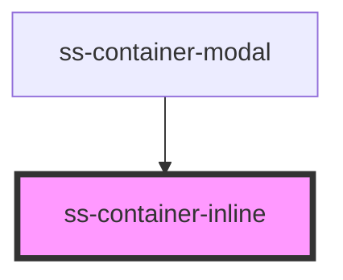

# ss-container-inline

<!-- Auto Generated Below -->

## Properties

| Property           | Attribute | Description    | Type     | Default     |
| ------------------ | --------- | -------------- | -------- | ----------- |
| `idp` _(required)_ | `idp`     | The first name | `string` | `undefined` |

## Dependencies

### Used by

 - [ss-container-modal](../ss-container-modal)

### Graph

----------------------------------------------

