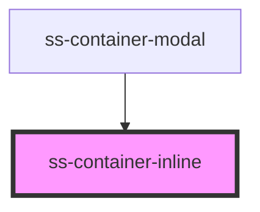

# ss-container-inline

<!-- Auto Generated Below -->

## Events

| Event            | Description                                                                                                                                                                                                  | Type                               |
| ---------------- | ------------------------------------------------------------------------------------------------------------------------------------------------------------------------------------------------------------ | ---------------------------------- |
| `authTokenError` | Emitted when a host-supplied getToken callback throws. Lets the host page react (e.g. re-authenticate the user) instead of the iframe silently dead-ending on the Forms "third-party cookies disabled" page. | `CustomEvent<{ error: unknown; }>` |

## Dependencies

### Used by

 - [ss-container-modal](../ss-container-modal)

### Graph

```mermaid
graph TD;
  ss-container-modal --> ss-container-inline
  style ss-container-inline fill:#f9f,stroke:#333,stroke-width:4px
```

----------------------------------------------

