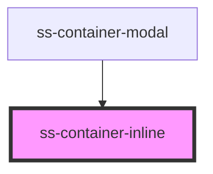

# ss-container-inline

<!-- Auto Generated Below -->

## Events

| Event       | Description                                                                                                                                                                                                                                                                                                                                                                                                                                                                         | Type                                                               |
| ----------- | ----------------------------------------------------------------------------------------------------------------------------------------------------------------------------------------------------------------------------------------------------------------------------------------------------------------------------------------------------------------------------------------------------------------------------------------------------------------------------------- | ------------------------------------------------------------------ |
| `authError` | Emitted when authentication cannot be established or kept for the embedded Forms app, so the host page can react (e.g. re-authenticate the user) instead of the iframe silently dead-ending. reason is 'token-callback-failed' when the host getToken callback throws or times out, 'iframe-auth-failed' when the Forms app reports its own auth failure from inside the iframe, and 'token-renewal-failed' when a renewal could not be completed before the current token ran out. | `CustomEvent<{ reason: WidgetAuthErrorReason; error?: unknown; }>` |

## Dependencies

### Used by

 - [ss-container-modal](../ss-container-modal)

### Graph

```mermaid
graph TD;
  ss-container-modal --> ss-container-inline
  style ss-container-inline fill:#f9f,stroke:#333,stroke-width:4px
```

----------------------------------------------

