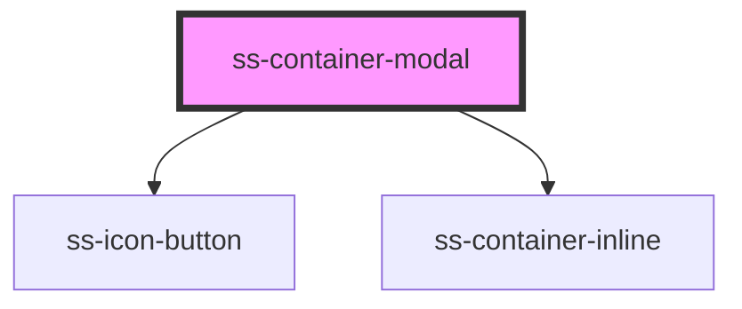

# ss-container-modal


<!-- Auto Generated Below -->


## Properties

| Property  | Attribute | Description                         | Type                                                                                                                         | Default     |
| --------- | --------- | ----------------------------------- | ---------------------------------------------------------------------------------------------------------------------------- | ----------- |
| `classes` | --        | Classes override for custom styling | `{ modalWrapper?: string; modalOverlay?: string; modalHeader?: string; modalContent?: string; maxWidthContainer?: string; }` | `undefined` |
| `open`    | `open`    | Should the modal be open            | `boolean`                                                                                                                    | `undefined` |


## Events

| Event            | Description                                                                                                                                                                                                                                                                                                                   | Type                |
| ---------------- | ----------------------------------------------------------------------------------------------------------------------------------------------------------------------------------------------------------------------------------------------------------------------------------------------------------------------------- | ------------------- |
| `closeClicked`   | Callback when close button clicked  Closing of the modal should happen automatically, but this event will also be called  Call with onCloseClicked (using JSX) or ```const ssContainerModal = document.querySelector('ss-container-modal'); ssContainerModal.addEventListener('closeClicked', event => {  your listener })``` | `CustomEvent<void>` |
| `refreshClicked` | Callback when refresh button clicked  Refresh will be handled automatically, but this event will also be called  Call with onCloseClicked (using JSX) or ```const ssContainerModal = document.querySelector('ss-container-modal'); ssContainerModal.addEventListener('refreshClicked', event => {  your listener })```        | `CustomEvent<void>` |


## Dependencies

### Depends on

- [ss-icon-button](../ss-icon-button)
- [ss-container-inline](../ss-container-inline)

### Graph


----------------------------------------------


