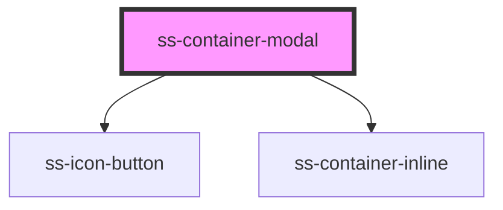

# ss-container-modal


<!-- Auto Generated Below -->


## Properties

| Property                  | Attribute                    | Description                                | Type                                                                                                                                                                                                                             | Default |
| ------------------------- | ---------------------------- | ------------------------------------------ | -------------------------------------------------------------------------------------------------------------------------------------------------------------------------------------------------------------------------------- | ------- |
| `isRefreshButtonEnabled`  | `is-refresh-button-enabled`  | Is refresh button shown (default disabled) | `boolean`                                                                                                                                                                                                                        | `false` |
| `open`                    | `open`                       | Should the modal be open                   | `boolean`                                                                                                                                                                                                                        | `true`  |
| `roundedEdges`            | `rounded-edges`              | Should the modal have a rounded edges      | `boolean`                                                                                                                                                                                                                        | `true`  |
| `shouldConstrainMaxWidth` | `should-constrain-max-width` | Should the modal have a maximum width      | `boolean`                                                                                                                                                                                                                        | `true`  |
| `showHeaderButtons`       | `show-header-buttons`        | Should the modal have a rounded edges      | `boolean`                                                                                                                                                                                                                        | `true`  |
| `showOverlay`             | `show-overlay`               | Should the modal have an overlay           | `boolean`                                                                                                                                                                                                                        | `true`  |
| `styleOverrides`          | --                           | Classes override for custom styling        | `{ modalWrapper?: { [key: string]: string; }; modalOverlay?: { [key: string]: string; }; modalHeader?: { [key: string]: string; }; modalContent?: { [key: string]: string; }; maxWidthContainer?: { [key: string]: string; }; }` | `{}`    |


## Events

| Event            | Description                                                                                                                                                                                                                                                                                                                              | Type                |
| ---------------- | ---------------------------------------------------------------------------------------------------------------------------------------------------------------------------------------------------------------------------------------------------------------------------------------------------------------------------------------- | ------------------- |
| `closeClicked`   | Callback when close button clicked  Closing of the modal should happen automatically, but this event will also be called  Call with onCloseClicked (if your app uses JSX) or ```const ssContainerModal = document.querySelector('ss-container-modal'); ssContainerModal.addEventListener('closeClicked', event => {  your listener })``` | `CustomEvent<void>` |
| `refreshClicked` | Callback when refresh button clicked  Refresh will be handled automatically, but this event will also be called  Call with onCloseClicked (if your app uses JSX) or ```const ssContainerModal = document.querySelector('ss-container-modal'); ssContainerModal.addEventListener('refreshClicked', event => {  your listener })```        | `CustomEvent<void>` |


## Dependencies

### Depends on

- [ss-icon-button](../ss-icon-button)
- [ss-container-inline](../ss-container-inline)

### Graph


----------------------------------------------


